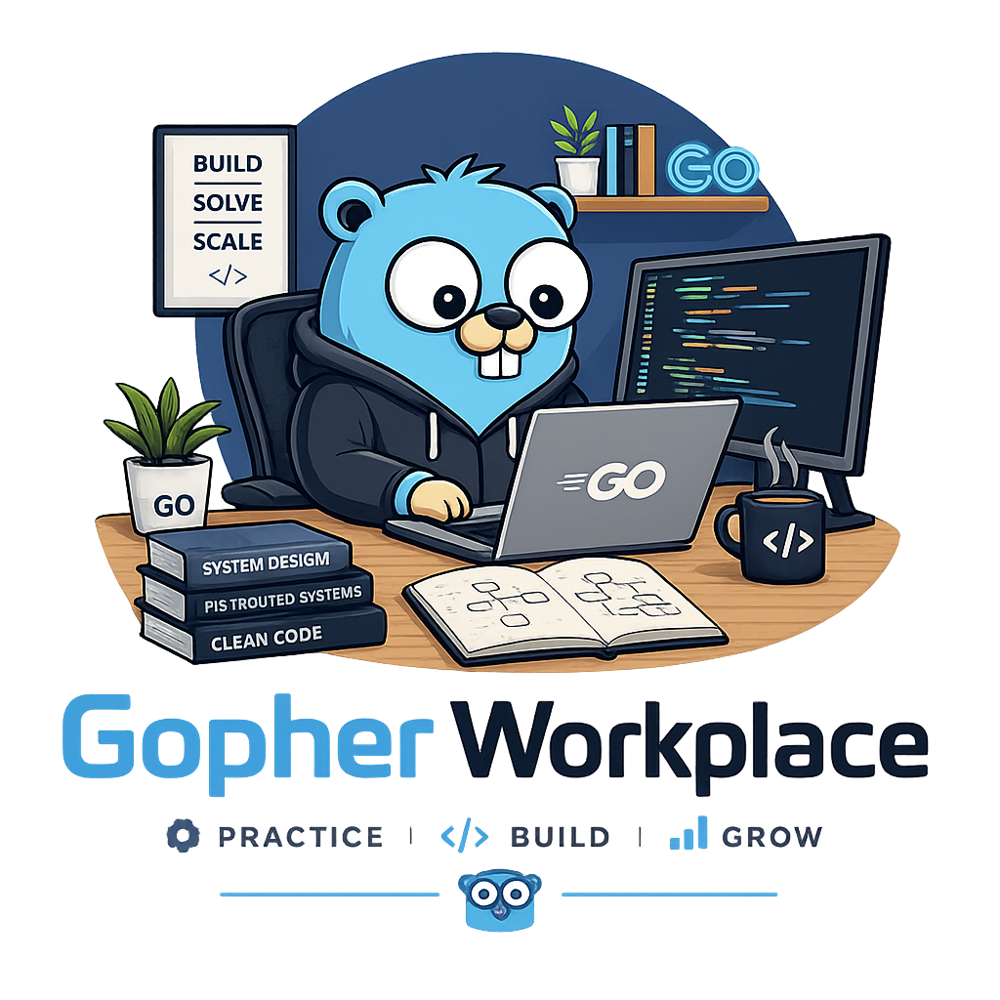

<p align="center">
  
</p>

<h1 align="center">Gopher Workplace</h1>

<p align="center"><em>Practice · Build · Grow</em></p>

<p align="center">
  A practice repo mirroring the Go roadmap as <strong>broken-code-fix puzzles</strong>.<br>
  Drive each puzzle red&nbsp;→&nbsp;green — implement a stub from scratch, or fix one planted bug.
</p>

---

## What is this

Every puzzle is its own Go module. You start from a failing state and make the
tests pass — either by:

- **implement-from-scratch** — flesh out a `panic("not implemented")` stub
  (junior / concept puzzles), or
- **fix one planted bug** — the single defect sits between
  `// CHANGE CODE BELOW/ABOVE THIS LINE` markers (senior / staff / debugging).

Puzzles follow the Go learning path in a strict total order: `level → topic →
subtopic`. A puzzle may only rely on concepts introduced **at or before** its
position — so the difficulty rises honestly as you climb.

## Levels

```
junior  <  middle  <  senior  <  staff
```

4 levels · 209 subtopic slots (35 / 62 / 75 / 37). Three axes rise with level:

| Axis | junior | staff |
|------|--------|-------|
| **scope** — concepts allowed | language basics | full language |
| **difficulty** — resource pressure | correctness only | CPU/time ceilings, race-free concurrency |
| **depth** — where the bug lives | surface | memory model |

## Layout

```
challenges/<level>/<NN-topic>/<MM-subtopic>/<puzzle>/
    go.mod  Makefile  <pkg>.go  <pkg>_test.go  README.md
```

Grid is **ragged** — a level only holds topics its subtopics need. Empty slots
hold a `.keep`; authoring a puzzle deletes it. `_template/` is the shape to copy.

Full spec: [challenges/PLAN.md](challenges/PLAN.md) (structure) and
[challenges/GENERATION.md](challenges/GENERATION.md) (authoring law).

## Install

### 1. Prerequisites

| Tool | Version | Why |
|------|---------|-----|
| **Go** | 1.26+ | runs every puzzle's tests, the local runner, and the catalog generator |
| **git** | any | clone + `make update` |
| **make** | any | the entry point for every command |

```bash
# macOS
brew install go

# Debian / Ubuntu — distro Go is often too old; prefer the tarball from go.dev/dl
sudo apt install -y git make

# check
go version
```

Go is the only hard requirement — no Python, no Node, no Docker, no database
server. The single non-stdlib dependency is a pure-Go SQLite driver, scoped to
the local runner module. (Python 3 is optional: `make serve` and the authoring
helper `scripts/coverage.sh` use it.)

### 2. Clone and bootstrap

```bash
git clone https://github.com/gopher-workplace/gopher-workplace.git
cd gopher-workplace
make setup
```

`make setup` does three things and stops on the first failure:

1. **tool check** — verifies `go` exists and is new
   enough for the puzzle `go.mod`s (it reads the required version out of the
   module, so it stays true as the repo moves).
2. **deps** — `go mod download` inside `site/cmd/localrunner` (the SQLite
   driver). Every *challenge* module is stdlib-only, so nothing to fetch there.
3. **catalog** — runs `site/cmd/gencatalog`, which regenerates
   `site/web/assets/js/problems.js` from the `challenges/` tree. That file is
   how the web UI learns what puzzles exist.

It's idempotent — safe to re-run any time.

### 3. Verify the install

```bash
make list                          # should print the authored puzzle modules
make -C challenges/junior/01-language-basics/01-variables-and-constants/swap verify
```

A fresh puzzle is **red** on purpose, so a failing test here is the expected
result — what you're checking is *how* it fails: a `panic: not implemented` (or
a wrong-value assertion) means the module compiled and the tests ran, so your
toolchain is fine. A missing-`go`/download/module error means it isn't. Same for `make verify` at
the repo root: it walks every module, so it stays red until you've solved them
all.

### 4. Start it

```bash
make dev        # runner + web UI, one process
```

Open <http://localhost:7070>. The runner serves the UI itself, so the page and
the backend share an origin — nothing else to start. A `● local runner` badge in
the nav means Run/Submit will execute the real `go test`. Ctrl-C stops it.

Prefer your own editor? Skip the UI entirely — `make list`, `cd` into a module,
`make test`. Each puzzle is a plain Go module.

## Configuration

Nothing is required — defaults work out of the box. Override when a port is
taken or you keep the repo somewhere unusual.

### Port

```bash
RUNNER_PORT=9090 make dev      # then open http://localhost:9090
```

One process, one port — the UI is served by the runner, so nothing to keep in
sync.

`make serve` is the exception: it serves `site/web/` as bare static files on
`WEB_PORT` (8080) via Python, with no backend. Useful for frontend work. Point
it at a runner on a non-default port with a query string, which sticks in
`localStorage` under `gw-runner`:

```
http://localhost:8080/?runner=http://localhost:9090
```

### Local runner flags / env

Run it directly for full control (its own module — run from its directory):

```bash
cd site/cmd/localrunner
go run . -port 9090 -root /path/to/gopher-workplace -db /tmp/gw.db
```

| Flag | Env | Default | Meaning |
|------|-----|---------|---------|
| `-host` | `GW_HOST` | `127.0.0.1` | listen address; leave it on loopback |
| `-port` | `GW_RUNNER_PORT` | `7070` | listen port |
| `-root` | `GW_ROOT` | auto-detect | dir containing `challenges/` (walks up) |
| `-db` | `GW_DB` | `~/.gopher-workplace/runner.db` | solve history; kept 30 days |

Delete the db file to reset your progress — it lives outside the repo, so it
survives `git pull` and `make clean`.

### Security note

The local runner **executes arbitrary Go code on your machine, as you** — that's
the point of using the real toolchain. Be clear about what it is and isn't:

**It is not a sandbox.** Submitted code runs with your user's file access and
your network. It can read your files and dial out. Only run code you would be
willing to run by hand.

What it does do:

- **Binds `127.0.0.1` only** — unreachable from the network. `-host` can change
  that; it prints a loud warning if you do.
- **Refuses cross-origin browser requests** — only pages served from loopback
  may call the API, so a random site you visit cannot drive it.
- **Caps concurrent runs** (2–4, by CPU count); over that it answers 503 rather
  than swamping the machine.
- Each request builds in a throwaway temp module, deleted afterwards.
- 20s timeout, then the whole process group is `SIGKILL`ed (infinite loops die).
- Isolated `GOCACHE`/`GOPATH`, and `GOPROXY=off` so a build cannot pull modules.
  This blocks *module downloads* — it does **not** stop code from opening
  sockets itself.
- `challengeId` paths are validated to stay inside `challenges/`.

## Troubleshooting

| Symptom | Fix |
|---------|-----|
| `go X too old — need 1.26+` | install a newer Go from <https://go.dev/dl/>; a distro package is often stale |
| Badge stays dark, "start it with…" hint | the runner isn't up — `make dev`, and open the runner's own port, not a separate static server |
| `address already in use` | `RUNNER_PORT=9090 make dev` |
| New puzzle missing from the sidebar | `make catalog` — the UI reads a generated file |
| Puzzle fails with an import error | you're editing the wrong module; `cd` into the puzzle dir first |
| Progress vanished | history is in `~/.gopher-workplace/runner.db` and swept after 30 days |
| `cross-origin request refused` | the page came from a non-loopback origin; open the runner's own URL |
| `runner busy: too many runs in flight` | the concurrency cap kicked in — retry in a moment |

## The public site

The site deploys as plain static files (`site/web/`), and what it publishes is
**browse-only**: the catalogue, every puzzle description, and the editor. Run
and Submit are disabled there.

That is not a missing feature. Executing a submission means running the real Go
toolchain, and the runner does that on *your* machine, as you — which is why it
binds loopback and refuses non-loopback origins. Hosting it would mean running
strangers' code on someone's server. So the published page detects no runner,
says so in a banner, disables the two buttons, and points at the setup above.
Start the runner locally and the same puzzle becomes runnable at
<http://localhost:7070>.

```bash
cd site && ./scripts/build.sh    # regenerates the catalog; publish web/
```

`site/netlify.toml` does exactly this: build with `scripts/build.sh`, publish
`web/`. Any static host works — there is nothing to run server-side.

## Updating to a new version

```bash
make update    # git pull --ff-only, then re-runs setup (deps + catalog)
```

New puzzles land in `challenges/`, so the catalog rebuild is what makes them
appear in the web UI — that's why `update` re-runs `setup`. It refuses to run on
a dirty working tree: commit or stash your solved puzzles first (`git stash` →
`make update` → `git stash pop`).

Your solve history lives outside the repo (`~/.gopher-workplace/runner.db`) and
survives updates. If a release bumps the Go version in the puzzle `go.mod`s,
`make update` will say so via `make setup`'s tool check — install the newer Go
and re-run.

## Make targets

`make help` prints this list at any time.

| Target | What it does |
|--------|--------------|
| `make setup` | tool check + `go mod download` for the runner + `make catalog` |
| `make update` | `git pull --ff-only` + re-run `setup` |
| `make dev` | runner + web UI in one process — `RUNNER_PORT=9090 make dev` |
| `make serve` | static UI only, no backend (frontend work; needs Python 3) |
| `make catalog` | regenerate `site/web/assets/js/problems.js` from `challenges/` |
| `make list` / `make verify` / `make test` | across every challenge module |
| `make site-test` | vet + test the local runner and catalog generator (100% covered) |
| `make reconstruct` | regenerate the challenge grid (keeps authored puzzles) |
| `make clean` | drop test caches |

## How to work a puzzle

Each puzzle is one Go module — solve it red → green:

1. **Pick one.** `make list` shows every module. `cd` into one.

   ```bash
   cd challenges/junior/01-language-basics/01-variables-and-constants/plan-limits
   ```

2. **Read the brief.** `README.md` in the folder = Context / Task / Examples /
   Topics to Master / hint.

3. **Confirm it's red.** Tests fail out of the box.

   ```bash
   make test
   ```

4. **Fix it.** Open the `<pkg>.go` file and either:
   - fill in the `panic("not implemented")` stub, or
   - fix the single planted bug between the
     `// CHANGE CODE BELOW/ABOVE THIS LINE` markers.

   Don't touch the function signature or the test file.

5. **Go green.** Full gate = fmt-check + vet + test.

   ```bash
   make verify      # PASS: challenge validated
   ```

Handy per-puzzle targets: `make test-v` (verbose), `make fmt` (format),
`make vet`, `make clean` (drop test cache).

## Run everything

```bash
make list          # list all challenge modules
make verify        # verify every authored puzzle (fmt-check + vet + test)
make reconstruct   # regenerate grid (idempotent, keeps puzzles)

# single puzzle from repo root
make -C challenges/<level>/<topic>/<subtopic>/<name> verify
```

## Play in the browser

A LeetCode-style web UI ships in [site/](site/): pick a puzzle from the sidebar,
edit in-page, and run the real test suite. Every puzzle runs against the genuine
Go toolchain via a small localhost backend (`site/cmd/localrunner`) — no wasm
sandbox, so all levels (including `-race` and GC-sensitive ones) work. Solve
history is kept in SQLite so your "submitted" state survives reloads.

```bash
make dev           # catalog already built by `make setup`
open http://localhost:7070
```

The runner serves the UI and the API from one port. Lower-level equivalents:

```bash
make catalog                                   # regenerate the problem catalog

# the runner is its own module — run it from its directory, not the repo root
cd site/cmd/localrunner && go run . -port 9090
```

Editor shortcuts: **Ctrl/Cmd+Enter** run · **Ctrl/Cmd+S** or
**Ctrl/Cmd+Shift+Enter** submit · **Ctrl/Cmd+/** toggle comment. Run
`make catalog` whenever you add or edit a puzzle so the sidebar picks it up.

## Authoring a puzzle

1. Pick a `.keep` slot, get its allowed history:
   `scripts/coverage.sh <level>/<NN-topic>/<MM-subtopic>`
2. Scaffold: `scripts/scaffold.sh <slot> <name> <Func>`
3. Stage the red state (stub **or** one planted bug), don't touch the signature
   or the task's tests.
4. Verify red → green. Delete the `.keep`.

See [CLAUDE.md](CLAUDE.md) for the short orientation and rules of engagement.
